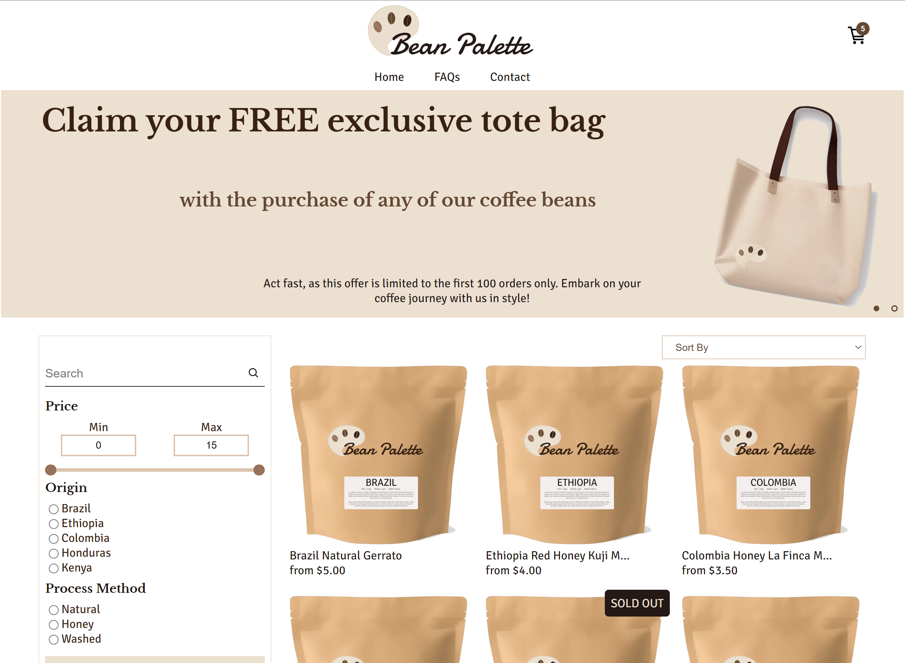
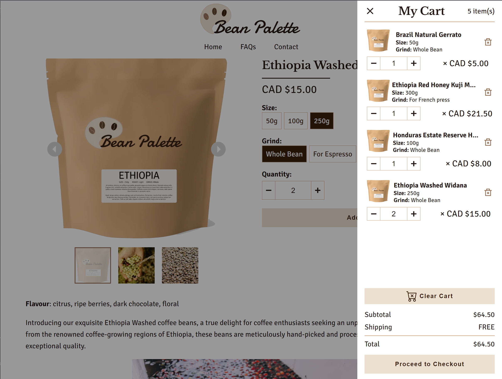

# Bean Palette

Bean Palette is a sample full-stack web application built with Next.js, Sanity, and Stripe, designed to provide a delightful online shopping experience for specialty coffee lovers. Get ready to embark on a flavour-filled journey with our coffee selections and enhance your coffee brewing experience. Happy brewing! :coffee:

- [Live Demo Here](https://bean-palette.vercel.app/)

## Features

- Browse a wide range of specialty coffee beans from different origins with different process methods
- Search for coffee beans based on the product name
- Filter and sort coffee beans based on preferences like name, origin, process method, and price range.
- View detailed product information, including product images and flavours
- Share products with family and friends with ease
- Pick the size, grind, and quantity for each product
- Add coffee beans to the cart, update quantities, and proceed to checkout
- Seamless payment processing with Stripe
- Leave messages to the store owner for any inquiries or feedback by filling in a contact form

## Built with

- HTML
- CSS
- React
- Typescript
- Next.js
- Sanity.io
- Stripe
